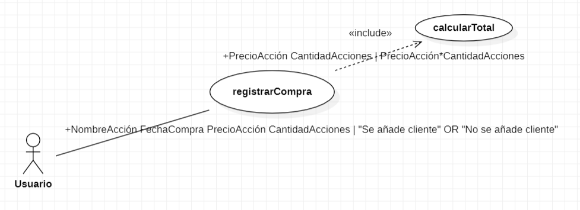

# ESCUELA POLITÉCNICA NACIONAL

## CONSTRUCCIÓN Y EVALUACIÓN DEL SOFTWARE 

### GRUPO 2
---
Integrantes:

- Paúl Román
- René Simbaña
- David Yánez

## Casos de Uso

### ESCENARIO BÁSICO:
1. El caso de uso comienza con el ingreso del nombre de acción, fecha de compra, precio de acción y cantidad de acciones por parte del usuario.
2. El sistema calcula el total de la compra.
3. Con estos datos ingresado el caso de uso termina registrando la compra de la acción.

### ESCENARIO ALTERNATIVO 1:

1.El caso de uso comienza con el usuario ingresando la información de la acción, que puede incluir el nombre de la acción, la fecha de compra, el precio de la acción y la cantidad de acciones.
2. Al momento de ingresar falta alguno de los atributos especificados.
3. El caso de uso termina sin registrar la compra de la acción.