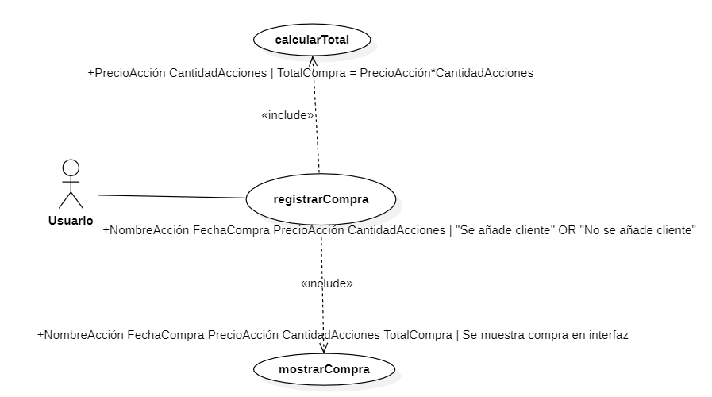
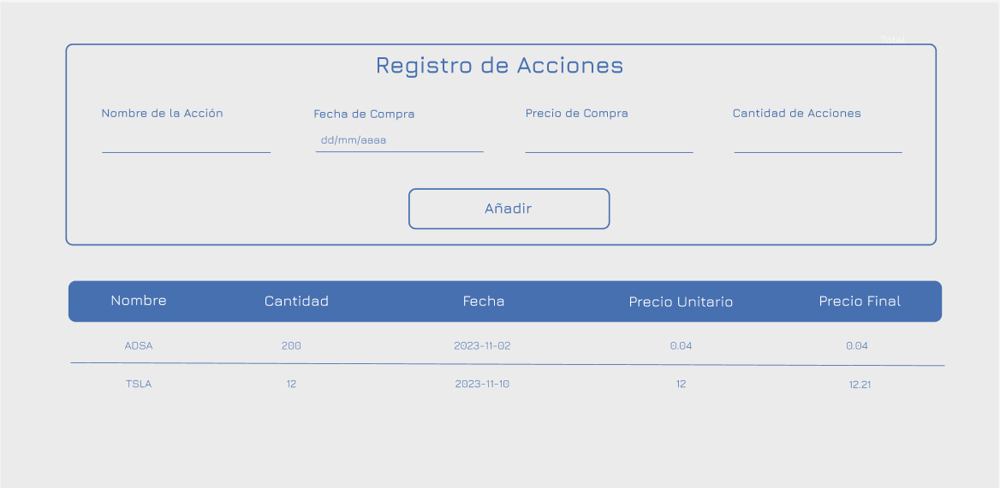

# ESCUELA POLITÉCNICA NACIONAL

## CONSTRUCCIÓN Y EVALUACIÓN DEL SOFTWARE 

### GRUPO 2
---
Integrantes:

- Paúl Román
- René Simbaña
- David Yánez

## Casos de Uso

  

  <em>Fig. 1. Diagrama de Casos de Uso</em>

### ESCENARIO BÁSICO:
1. El caso de uso comienza con el ingreso del nombre de acción, fecha de compra, precio de acción y cantidad de acciones por parte del usuario.
2. El sistema calcula el total de la compra.
3. El sistema registra la compra de la acción.
4. Con estos datos ingresados el caso de uso termina mostrando la compra realizada en la interfaz.

### ESCENARIO ALTERNATIVO 1:

1. El caso de uso comienza con el usuario ingresando la información de la acción, que puede incluir el nombre de la acción, la fecha de compra, el precio de la acción y la cantidad de acciones.
2. Al momento de ingresar falta alguno de los atributos especificados.
3. El caso de uso termina sin registrar la compra de la acción.

## Diseño de UI

Se realizó el diseño de la interfaz gráfica en la plataforma Figma, como se puede apreciar en el siguiente [enlace](https://www.figma.com/file/APbXJAGFs3UCKE62pfHrs4/Acciones?type=design&node-id=0%3A1&mode=design&t=Z20k1EeWsSyGkz4l-1). 

  

  <em>Fig. 2. Prototipo de UI de alta fidelidad</em>

