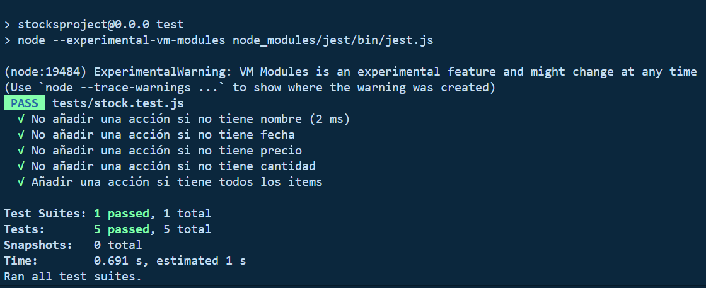

# ESCUELA POLITÉCNICA NACIONAL

## CONSTRUCCIÓN Y EVALUACIÓN DEL SOFTWARE 

### GRUPO 2
---
Integrantes:

- Paúl Román
- René Simbaña
- David Yánez

# Test de las pruebas unitarias del sistema de gestión de acciones

  

  <em>Fig. 1. Verificación del Test de pruebas unitarias</em>

